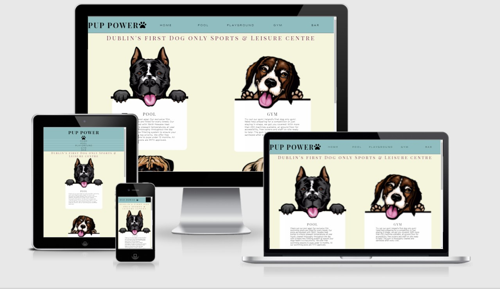
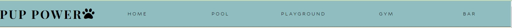
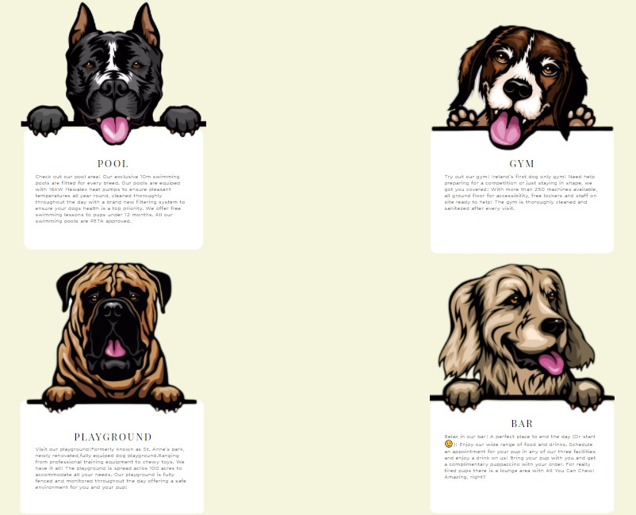
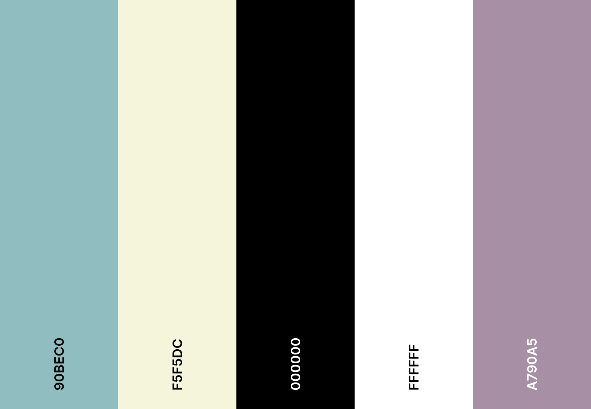

# Pup Power

Pup Power is a website made for a Dog Leisure Centre based in 
Dublin, Ireland.
It's a first ever Dog-Only Leisure Centre. The centre's main goal is encouraging pet owners of taking better care for their dogs health.
Facilities include indoor and outdoor pools, 100 acre playground with all the commodities, large gym and a bar which serves both food and drinks.
[View the live project here.](https://marosan28.github.io/pup-power/)

## Features
- __Navigation Bar__

  - Featured on all pages, includes links to Home, Pool, Playground, Gym and Bar sections.
    - Navigation bar will allow user to navigate from page to page easily on all devices.

- __Landing Page__

  - The landing page consists of four dog illustrations each above a white box wich represents different pages on a website. Inside the boxes there is a brief explanation of each of the pages.
    - Each dog has a different box with a clickable name, meaning a user can access the page both from the navigation bar and from the text boxes.

    

 ## First Time Visitor Goals
-   ### User stories

    -   #### First Time Visitor Goals

        1. As a First Time Visitor, I want to easily understand the main 
        purpose of the site.

        2. As a First Time Visitor, I want to be able to easily navigate throughout the site.

        3. As a First Time Visitor, I want to look for contact information and address to see where they are located and how to reach out. 

    -   #### Returning Visitor Goals

        1. As a Returning Visitor, I want to find information about benefits of letting my pet engage in offered activities.
        2. As a Returning Visitor, I want to find classes currently available.
        3. As a Returning Visitor, I want to find coach information.

    -   #### Frequent User Goals
        1. As a Frequent User, I want to check to see the current monthly offer.
        2. As a Frequent User, I want to check class schedule every week.
        3. As a Frequent User, I want to register so I can receive all offers available.
-   ### Design
    -   #### Colour Scheme
        -   The colour palette used on this website is: 

            

            The colour palette was generated by [Coolors website](https://coolors.co/)

    -   #### Typography
        -   The *Hubballi* font is the main font used throughout the whole website with Sans Serif as the fallback. *Hubballi* is used because of the roundness of letters. Round shapes give the content softness, which makes a website appeal friendly and inviting.
        The *Playfair Display SC* font is used for all the headings throught the website, as it's fancy and more elegant, it's job is to bring the attention to the content. 
    -   #### Imagery
        -   The main images used are illustrations of dogs holding white boxes which were used as text boxes. The illustrations are giving the site uniqueness. They are more visually appealing and they add humor which makes the website appear fun.
         *   ### Wireframes

    -   Home Page Wireframe - [View](wireframes/images/index-page.jpg)

    -   Pool Page Wireframe - [View](wireframes/images/pool-page.jpg)

    -   Playground Page Wireframe - [View](wireframes/images/playground-page.jpg)

    -   Gym Page Wireframe - [View](wireframes/images/gym-page.jpg)

    -   Bar Page Wireframe - [View](wireframes/images/bar-page.jpg)

   
## Features

-   Responsive on all device sizes
    -The website is made to be responsive on all devices.

-   Button
    -The website has one join button on pool page which takes the user to a form page.

-   Logo
    -The Logo of the website is located in the top left corner and will take you to the home page when clicked.

## Technologies Used

### Languages Used

-   [HTML5](https://en.wikipedia.org/wiki/HTML5)
-   [CSS3](https://en.wikipedia.org/wiki/Cascading_Style_Sheets)

### Frameworks, Libraries & Programs Used

1. [Google Fonts:](https://fonts.google.com/)
    - Google fonts were used to import the 'Hubballi'and 'Playfair Display SC' font into the style.css file which is used on all pages throughout the project.
1. [Font Awesome:](https://fontawesome.com/)
    - Font Awesome was used on all pages throughout the website in the name of the Leisure Centre.
1. [JavaScript:](https://javascript.com/)
    - JavaScript was used to make the navbar responsive, hamburger menu for small screen sizes.
1. [Git](https://git-scm.com/)
    - Git was used for version control by utilizing the Gitpod terminal to commit to Git and Push to GitHub.
1. [GitHub:](https://github.com/)
    - GitHub is used to store the projects code after being pushed from Git.
1. [Balsamiq:](https://balsamiq.com/)
    - Balsamiq was used to create the [wireframes](https://github.com/) during the design process.
1. [ShutterStock:](https://shutterstock.com/)
    - Shutterstock was used to edit the images throught the site.
1. [TinyPNG:](https://tinypng.com/)
    - TinyPNG was used to compress images throught the website.

    ## Testing

The W3C Markup Validator and W3C CSS (Jigsaw) Validator Services were used to validate every page of the project to ensure there were no syntax errors in the project.

-   [W3C Markup Validator](https://jigsaw.w3.org/css-validator/#validate_by_input) - [Results]()
-   [W3C CSS Validator](https://jigsaw.w3.org/css-validator/#validate_by_input) - [Results]()

### Testing User Stories from User Experience (UX) Section

-   #### First Time Visitor Goals

     - As a First Time Visitor, I want to easily understand the main purpose of the site.

        1. When entering the site, users are immediately greeted with an easily readable navigation bar which will take them to the page of their choice. 
        2. There are 4 main images in the middle of the page, each with a title corresponding to one of the navigation bar buttons.
        3. The user has two options, click the navigation bar buttons or click one of the titles, each will bring him to the same place.

    - As a First Time Visitor, I want to be able to easily navigate throughout the site.

        1. The site has been designed with a clear navigation bar at the top of each page which clearly states what page user is currently on.
        2. On the form page nav bar is also present so visitor can easily go back to where he was before.

    - As a First Time Visitor, I want to look for contact information and address to see where they are located and how to reach out.

        1. On each page at the footer the user can find the contact information including a phone number, address and an email where he can reach out.

-   #### Returning Visitor Goals

    1. As a Returning Visitor, I want to find information about benefits of letting my pet engage in offered activities.

        1. On Pool, Playground and Gym pages the user can find information about exercise effects on dogs. How much exercise they need and what exactly it does to their body. 
        2. The text boxes are clearly visible and made with borders to make them stand out.

    2. As a Returning Visitor, I want to find classes currently available.

        1. There are two tables in total on the website.
        2. The first table is made for swimming classes and thereafore is on the Pool page of the website.
        3. The second table is for all the other classes Pup Power is offering and is on the Gym page, as all the
            other classes are kept there.

     2. 3. As a Returning Visitor, I want to find coach information.

        1. On the Pool page there are images with clealry stated names of all swimming coaches at Pup Power.
        2. Every coach has a little bit about me written next to the picture with their name.
        3. The table on the pool page also outlines the coaches working hours and dog age groups they are currently working with.

-   #### Frequent User Goals

    1. As a Frequent User, I want to check to see the current monthly offer.

        1. The monthly offers will always be at the top of the each page, the user should be well known with the page layout by now and would be able to easily navigate through all the pages.

     2. As a Frequent User, I want to check class schedule every week.

        1. Class schedule rotates every week, the schedule is written in the table on the Gym page of the website, the user is known with the layout and always finds information at the same place.

    3. As a Frequent User, I want to register so I can receive all offers available.

        1. At the pool page there is a "Join Now" button, frequent users can sign up to join the Leisure Centre and therafore receive offers not available to non members. 

    

