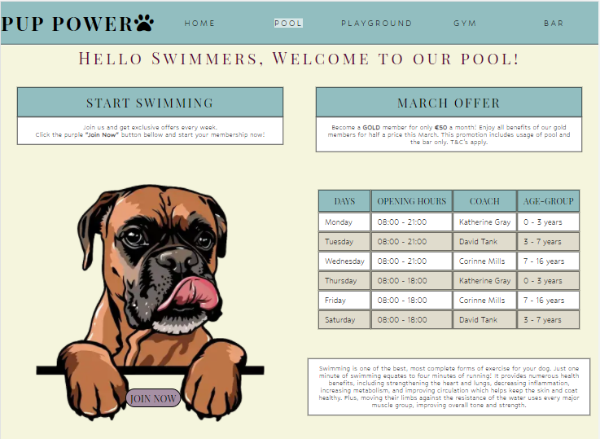
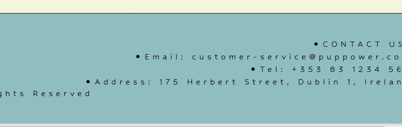

# Pup Power

    This project was made as a part of a Full Stack Developer Programme by Code Institute. All information contained on the page is intended for course use only.
    [View the live project here.](https://marosan28.github.io/pup-power/)
-----
## Who is this website for and what does it do? 

Pup Power is a website made for a Dog Leisure Centre based in 
Dublin, Ireland. It's a first ever Dog-Only Leisure Centre. The centre's main goal is encouraging pet owners of taking better care for their dogs health. The website is targeted towards all pet owners and dog lovers. Pup Power offers different facilities with a range of activities made specifically to boost dogs health and agility. Facilities include indoor and outdoor pools, 100 acre playground with all the commodities, large gym and a bar which serves both food and drinks.

-----

## Main Features
- __Navigation Bar__

  - Featured on all pages, includes links to Home, Pool, Playground, Gym and Bar sections.
    - Navigation bar will allow user to navigate from page to page easily on all devices.
    - The Logo of the website is located in the top left corner and will take you to the home page when clicked.
    - Every page contains a highlighted link of a page that is currently open to help with the users understanding of the site layout and to make navigation easier.

- __Landing Page__

  - The landing page consists of four dog illustrations each above a white box which represents different pages on a website. Inside the boxes there is a brief explanation of each of the pages.
    - Each dog has a different box with a clickable name, meaning a user can access the page both from the navigation bar and from the text boxes.

- __The Footer__ 

  - The footer section contains contact information, email, phone number and the address of the Leisure centre, the visitor has easy access to any contact information needed.

- __Pool Landing Page__ 

  - When a user lands on a pool section page he is greeted with this month's pool offers, and opening hours. There is a "Join Now" button in dogs paws which takes the user on a form page. The big table shows days, opening hours, coaches working the relevant day and the age groups they are currently working with. The data is shown in a clear way. There is a paragraph about why swimming is important for dogs health which provides the user with usefull information on why they should sing up their dog to our class and what benefits will come out of it.

- __Form__ 

  - A dummy form was made for the website. The link used was the one used by Code Institute. The Form is made so a user can join the newsletter of Pup Power. The data collected is personal information like name, email and password with the dogs personal information like breed and gender.

- __Pool Second Part Of The Page__ 

  - Second section of the pool page shows images of the coaches and something about each coach. User can determine which coach they think would be the best choice for their needs. The images are here because visuals are processed quickly and cause a faster and stronger reaction than just words. There is also an image on the right with the note about our indoor pools. More people preffer indoor pools during spring because of low temperatures. User knows he can book a session regardless of the weather. 

- __Playground Landing Page__ 

  - Playground landing page highlights the features currently available at the facility. Reasons dogs should play, visitor knows what is offered and why he should bring his pet to the playground. The same principles are maintained with dog images to make information transfer easier. 

- __Playground Second Part Of The Page__ 

  - Second part of the page showcases images of the park and the playground. As the playground is open all the time, the use of coaches is optional, useful information about dog training is provided for visitors who wish to train their dog on the premises. The information is provided on the white background with black contrast text, different titles are visually seperated for easier understanding. 

- __Gym Landing Page__ 

  - Gym Landing page has a central image of a dog holding a weight, the image aids to the fun and friendly appeal of the site and is supposed to encourage a positive reaction from a user. Below the image there is a link that will take the user to the form page where he can sign up. Useful information about dogs and exercises is situated below. Provides answers to any questions visitior may have about dogs and exercise. 

- __Gym Second Part Of The Page__ 

  - Second part of the gym page contains a big table of class schedules currently offered at Pup Power. The user has answers to what, where, when and who. 

- __Bar Page__ 

  - The Bar page has highlighted menu in the middle and offers currently available. The offer on the right side has a link which takes the user to the home page where instructions on how to get a free puppachino are provided.

 ## First Time Visitor Goals
-   ### User stories

    -   #### First Time Visitor Goals

        1. As a First Time Visitor, I want to easily understand the main 
        purpose of the site.

        2. As a First Time Visitor, I want to be able to easily navigate throughout the site.

        3. As a First Time Visitor, I want to look for contact information and address to see where they are located and how to reach out. 

    -   #### Returning Visitor Goals

        1. As a Returning Visitor, I want to find information about benefits of letting my pet engage in offered activities.
        2. As a Returning Visitor, I want to find classes currently available.
        3. As a Returning Visitor, I want to find coach information.

    -   #### Frequent User Goals
        1. As a Frequent User, I want to check to see the current monthly offer.
        2. As a Frequent User, I want to check class schedule every week.
        3. As a Frequent User, I want to register so I can receive all offers available.
-   ### Design
    -   #### Colour Scheme
        -   The colour palette used on this website is: 

            

            The colours chosen are soft, opal #90bec0 is calming for the eyes while lilac #a790a5 is considered a happy color, beige #f5f5dc is a soft colour that makes a perfect background in this case.
            The colour palette was generated by [Coolors website](https://coolors.co/)

    -   #### Typography
        -   The *Hubballi* font is the main font used throughout the whole website with Sans Serif as the fallback. *Hubballi* is used because of the roundness of letters. Round shapes give the content softness, which makes a website appeal friendly and inviting.
        The *Playfair Display SC* font is used for all the headings throught the website, as it's fancy and more elegant, it's job is to bring the attention to the content. 
    -   #### Imagery
        -   The main images used are illustrations of dogs holding white boxes which were used as text boxes. The illustrations are giving the site uniqueness. They are more visually appealing and they add humor which makes the website appear fun.
        -   The landscape images are used because of their brightness and colours present in the images. As their bright colours provide a contrast to the soft page they give the website a more lively look. 
        -   The portrait images were used because of the clear background which makes them appear clean and blend in with the layout. 
         *   ### Wireframes

    -   Home Page Wireframe - [View](wireframes/images/index-page.jpg)

    -   Pool Page Wireframe - [View](wireframes/images/pool-page.jpg)

    -   Playground Page Wireframe - [View](wireframes/images/playground-page.jpg)

    -   Gym Page Wireframe - [View](wireframes/images/gym-page.jpg)

    -   Bar Page Wireframe - [View](wireframes/images/bar-page.jpg)

## Technologies Used

### Languages Used

-   [HTML5](https://en.wikipedia.org/wiki/HTML5)
-   [CSS3](https://en.wikipedia.org/wiki/Cascading_Style_Sheets)

### Frameworks, Libraries & Programs Used

1. [Google Fonts:](https://fonts.google.com/)
    - Google fonts were used to import the 'Hubballi'and 'Playfair Display SC' font into the style.css file which is used on all pages throughout the project.
1. [Font Awesome:](https://fontawesome.com/)
    - Font Awesome was used on all pages throughout the website in the name of the Leisure Centre.
1. [JavaScript:](https://javascript.com/)
    - JavaScript was used to make the navbar responsive, hamburger menu for small screen sizes.
1. [Git](https://git-scm.com/)
    - Git was used for version control by utilizing the Gitpod terminal to commit to Git and Push to GitHub.
1. [GitHub:](https://github.com/)
    - GitHub is used to store the projects code after being pushed from Git.
1. [Balsamiq:](https://balsamiq.com/)
    - Balsamiq was used to create the wireframes during the design process.
1. [ShutterStock:](https://shutterstock.com/)
    - Shutterstock was used to edit the images throught the site.
1. [TinyPNG:](https://tinypng.com/)
    - TinyPNG was used to compress images throught the website.

    ## Testing

The W3C Markup Validator and W3C CSS (Jigsaw) Validator Services were used to validate every page of the project to ensure there were no syntax errors in the project.

-   [W3C Markup Validator](https://jigsaw.w3.org/css-validator/#validate_by_input) - [Results](wireframes/images/html-validator.jpg)
-   [W3C CSS Validator](https://jigsaw.w3.org/css-validator/#validate_by_input) - [Results](wireframes/images/css-validator.jpg)

### Acessibility
- Google Lighthouse
-   Website was tested using [Google Chrome Lighthouse](https://developers.google.com/web/tools/lighthouse)

  

- Desktop results

### Testing User Stories from User Experience (UX) Section

-   #### First Time Visitor Goals

    1. As a First Time Visitor, I want to easily understand the main purpose of the site.

        1. When entering the site, users are immediately greeted with an easily readable navigation bar which will take them to the page of their choice. 
        2. There are 4 main images in the middle of the page, each with a title corresponding to one of the navigation bar buttons.
        3. The user has two options, click the navigation bar buttons or click one of the titles, each will bring him to the same place.
        4. Current page is always going to be highlighted. 

    2. As a First Time Visitor, I want to be able to easily navigate throughout the site.

        1. The site has been designed with a clear navigation bar at the top of each page which clearly states what page user is currently on.
        2. On the form page nav bar is also present so visitor can easily go back to where he was before.

    3. As a First Time Visitor, I want to look for contact information and address to see where they are located and how to reach out.

        1. On each page at the footer the user can find the contact information including a phone number, address and an email where he can reach out.

-   #### Returning Visitor Goals

    1. As a Returning Visitor, I want to find information about benefits of letting my pet engage in offered activities.

        1. On Pool, Playground and Gym pages the user can find information about exercise effects on dogs. How much exercise they need and what exactly it does to their body. 
        2. The text boxes are clearly visible and made with borders to make them stand out.

    2. As a Returning Visitor, I want to find classes currently available.

        1. There are two tables in total on the website.
        2. The first table is made for swimming classes and thereafore is on the Pool page of the website.
        3. The second table is for all the other classes Pup Power is offering and is on the Gym page, as all the
            other classes are kept there.

     2. 3. As a Returning Visitor, I want to find coach information.

        1. On the Pool page there are images with clealry stated names of all swimming coaches at Pup Power.
        2. Every coach has a little bit about me written next to the picture with their name.
        3. The table on the pool page also outlines the coaches working hours and dog age groups they are currently working with.

-   #### Frequent User Goals

    1. As a Frequent User, I want to check to see the current monthly offer.

        1. The monthly offers will always be at the top of the each page, the user should be well known with the page layout by now and would be able to easily navigate through all the pages.

     2. As a Frequent User, I want to check class schedule every week.

        1. Class schedule rotates every week, the schedule is written in the table on the Gym page of the website, the user is known with the layout and always finds information at the same place.

    3. As a Frequent User, I want to register so I can receive all offers available.

        1. At the pool page there is a "Join Now" button, frequent users can sign up to join the Leisure Centre newsletter and therafore receive offers not available to non members.

### Further Testing

-   The Website was tested on Google Chrome, Opera and Mozzila Firefox.
- The website was tested on Google Pixel 4a and Iphone 6s

### Known Bugs

-Current bug on Mozzila Firefox 

## Deployment

### GitHub Pages

To deploy the site to Github pages the following steps should be followed: 

1. Log in to GitHub and locate the [GitHub Repository](https://github.com/)
2. At the top of the Repository (not top of page), locate the "Settings" Button on the menu.
3. Scroll down the Settings page until you locate the "GitHub Pages" that now has it's own dedicated tab.
4. Under "Source", click the dropdown called "None" and select "Master Branch".
5. The page will automatically refresh.
6. The link to your page will now show up with "Your site is published at:" 

### Forking the GitHub Repository

Forking the GitHub Repository means we make a copy of the original repository on our GitHub account to view and make changes without affecting the original repository by using the following steps...

1. Log in to GitHub and locate the [GitHub Repository](https://github.com/) you want to fork.
2. At the top of the Repository (not top of page) just above the "Settings" Button on the menu, you will see a fork button.
3. Click on the button to create a copy. 
4. You should now have a copy of the original repository in your GitHub account.

### Making a Local Clone

1. Log in to GitHub and locate the [GitHub Repository](https://github.com/) you want to deploy.
2. Under the repository name, click "Clone or download".
3. To clone the repository using HTTPS, under "Clone with HTTPS", copy the link.
4. Open Git Bash in your IDE.
5. Change the current working directory to the location where you want the cloned directory to be made.
6. Type `git clone`, and then paste the URL you copied.
7. Press enter and the clone should be created.

## Credits

### Code

-   The hamburger menu came from [W3 Schools](https://www.w3schools.com/howto/howto_js_mobile_navbar.asp)

### Content

- The information about benefits for dog swimming was found on [here](https://topdoghealth.com/the-top-5-benefits-of-swimming-for-dogs/)
- The playground information about why dogs need to play was found [here](https://www.pedigree.com/dog-care/health/the-serious-benefits-of-play) and the information about dog training was found [here](https://vcahospitals.com/know-your-pet/dog-behavior-and-training---play-and-exercise)
- The Gym information was found [here](https://www.thefarmersdog.com/digest/how-much-exercise-do-dogs-need/)
- Terms and Conditions template was found [here](https://www.privacypolicies.com/blog/sample-terms-conditions-template/)

### Media

-  Dog images were found on [123RF](https://www.123rf.com/) and edited via [shutterstock editor](https://www.shutterstock.com/editor)

- The playground and park images were found on [shutterstock](https://www.shutterstock.com)

### Acknowledgements

-   My Mentor for continuous tips and helpful feedback.

-   Slack student support.

-   [Kevin Powell](https://www.youtube.com/kevinpowell) for all the tutorials that helped me throughout the project.

